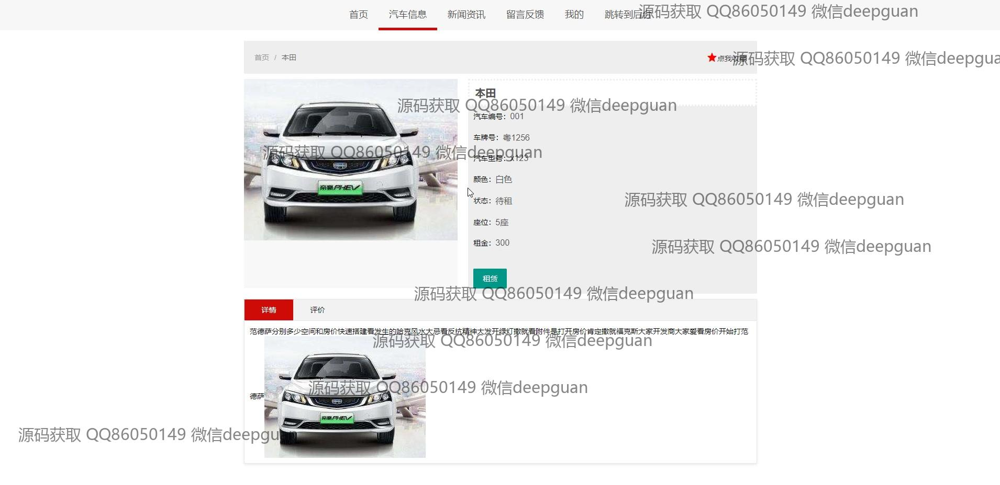
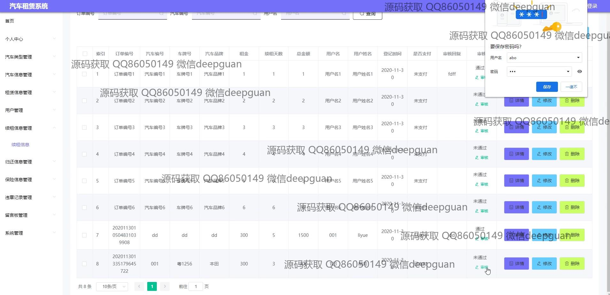

<h1 align="center">的汽车租赁系统vue</h1>

## 简介
汽车租赁系统：角色分为管理员、用户；功能包括租赁信息管理、车辆类型管理、用户注册与登录、车辆信息录入、订单审核、支付、留言反馈与归还信息管理等。    --计算机毕业设计源码；毕设源码；java毕业设计源码

## 联系方式

<h3 align="center">获取完整代码与数据库文件 + 微信：deepguan QQ: 86050149 QQ群: 783742310</h3>

<h3 align="center">可帮忙远程部署 包运行成功！提供远程部署、修改代码、设计文档指导、代码讲解等服务！</h3>

## 功能介绍（完整见运行截图）
管理员：  
基本功能：登录、注册、退出，支持以管理员身份管理系统。  
系统管理：包括汽车类型管理、车辆信息管理、租赁信息管理、用户管理、续租信息管理、归还信息管理、违章记录管理和保险信息管理。  
操作管理：支持对车辆、订单和用户信息的增删改查，以及订单审核、支付管理等功能。  
个人中心：查看和编辑个人信息，包括用户名、密码、联系方式等。  

用户：  
基本功能：登录、注册、退出，支持以用户身份进行租车操作。  
车辆服务：查看汽车类型和详细信息，包括车牌号、品牌、状态等，支持搜索、收藏和租赁功能。  
订单管理：查询、续租、归还租赁订单，并查看订单的详细信息及状态。  
个人中心：编辑个人信息，管理我的收藏和留言反馈，查看历史订单与支付记录。

## 运行截图

本代码来源于网络,仅供学习参考使用!

